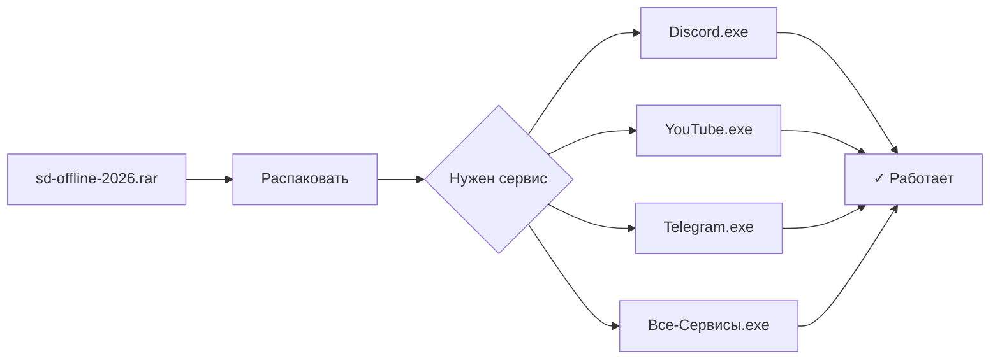

<!-- seo-unique:sd-offline-2026:3a240ef191 -->

 

  

### 🚀 Sd Offline 2026

**Discord + YouTube + Telegram — один архив, готовые exe**

*Обход DPI в России · Zapret / GoodbyeDPI · без настроек*

 

 

> [!IMPORTANT]
> **Скачать и запустить**
>
> | | |
> | :---: | :--- |
> | **①** | **[Releases](./releases/latest)** |
> | **②** | **`sd-offline-2026.rar`** |
> | **③** | **`Обход-Все-Сервисы.exe`** |
> | **✓** | Discord · YouTube · Telegram **работают** |

> [!NOTE]
> В корне репозитория уже лежат все **exe** — можно не качать архив и нажать **`START.bat`**.

---

## 📦 Состав сборки

| | Сервис | Файл |
| :---: | :--- | :--- |
| 💬 | **Discord** — голос, RTC, медиа | `Исправить-Discord.exe` |
| 📺 | **YouTube** — просмотр, 4K | `Исправить-YouTube.exe` |
| ✈️ | **Telegram** — десктоп | `Исправить-Telegram.exe` |
| 🔧 | **DPI / Zapret** | `Обход-DPI-Zapret.exe` |
| 🌐 | **Всё сразу** | `Обход-Все-Сервисы.exe` |

---

## ✨ Зачем эта сборка

Один архив вместо десятка bat-стратегий — скачал, открыл exe, пользуешься.

---

## 🛡️ Безопасность

> [!WARNING]
> **Антивирус:** возможен детект WinDivert — добавьте папку в исключения.

> [!CAUTION]
> **Фейки:** официальная загрузка только из [Releases](./releases/latest) на GitHub.

---

## ❓ FAQ

<b>Не работает один из сервисов</b>

Закройте все приложения (Discord из трея тоже) → запустите **`Обход-Все-Сервисы.exe`** → откройте снова. Не используйте VPN одновременно.

<b>Нужен только Discord / только YouTube</b>

Запустите соответствующий exe из таблицы выше.

---

 

**Нашёл полезным? Поставь ⭐ — поможет другим найти сборку**

 

<code>sd-offline-2026</code> · #zapret-discord-youtube #rkn-bypass #no-vpn #net-unblock #unblock-discord #unblock-youtube #unblock-telegram #fix-2026

  

<!-- id:254c85dc08cf -->
